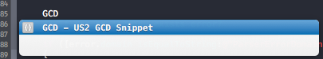
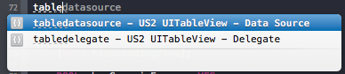
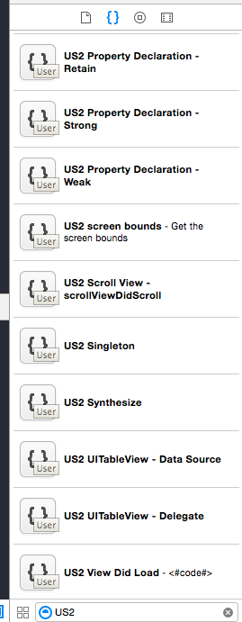

xcode-snippets
==============

A collection of Objective-C code snippets to help autocomplete common API routines whilst coding iOS or OS X applications.

Contributions are welcome especially Swift!

## Dependencies

* [Xcode](https://itunes.apple.com/gb/app/xcode/id497799835?mt=12)

### Setup

* Clone the repo into the CodeSnippets directory 

- <code>git clone git@github.com:ustwo/xcode-snippets.git ~/Library/Developer/Xcode/UserData/CodeSnippets/</code>

* Restart Xcode

* That's it!

### Usage 

For example using the Xcode inspector filter code snippets by "US2" at the bottom to browse the snippets. Drag the snippet into your code or alternatively use the custom keyboard shortcuts e.g. type AlertView, tableview, GCD etc. into the code followed by the Return key to insert.

See <a href="https://developer.apple.com/library/mac/recipes/xcode_help-source_editor/chapters/CreatingaCustomCodeSnippet.html">here</a> for more info

### Screenshots

### Team

* Development: [Martin Stolz](mailto:martin@ustwo.com?subject=xcode-snippets), [Shagun Madhikarmi](mailto:shagun@ustwo.com?subject=xcode-snippets)

